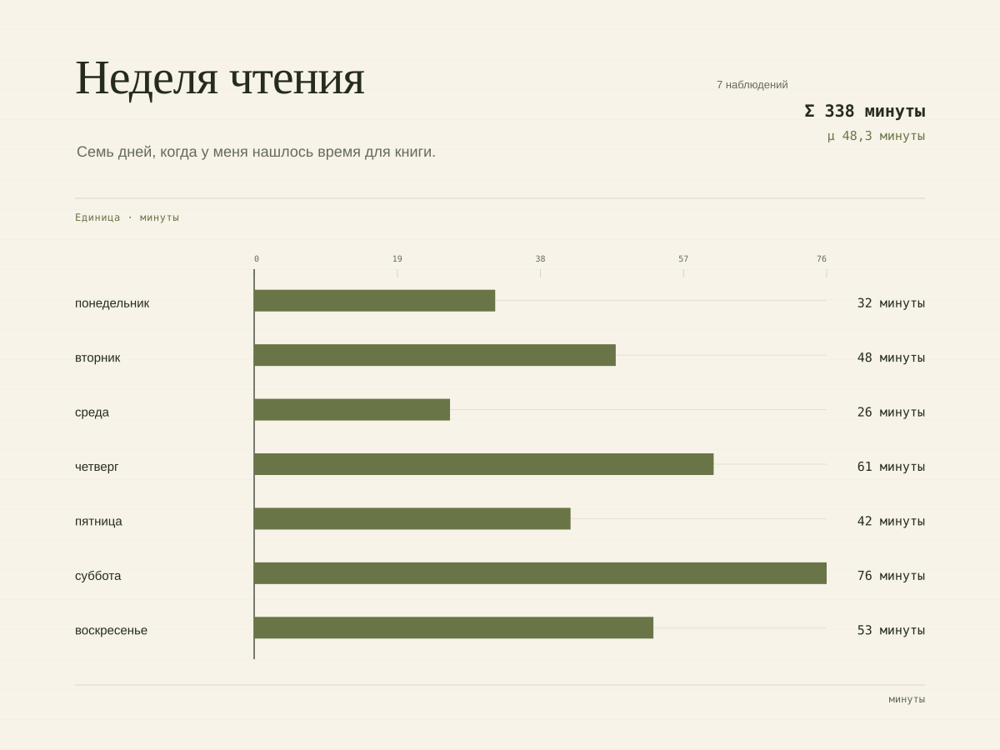
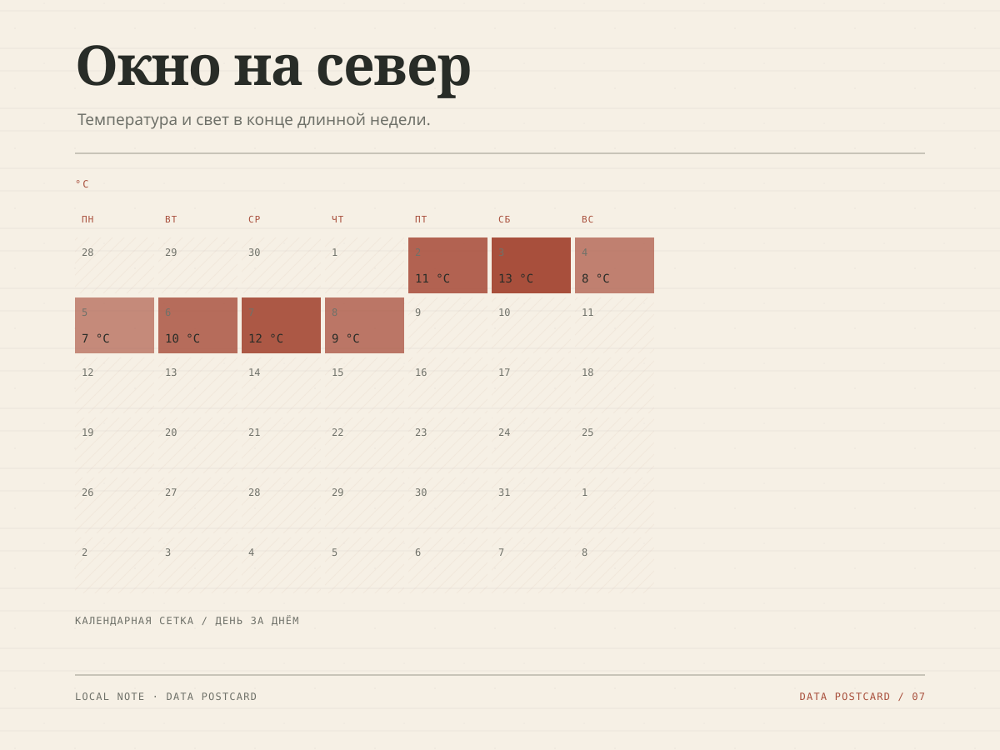
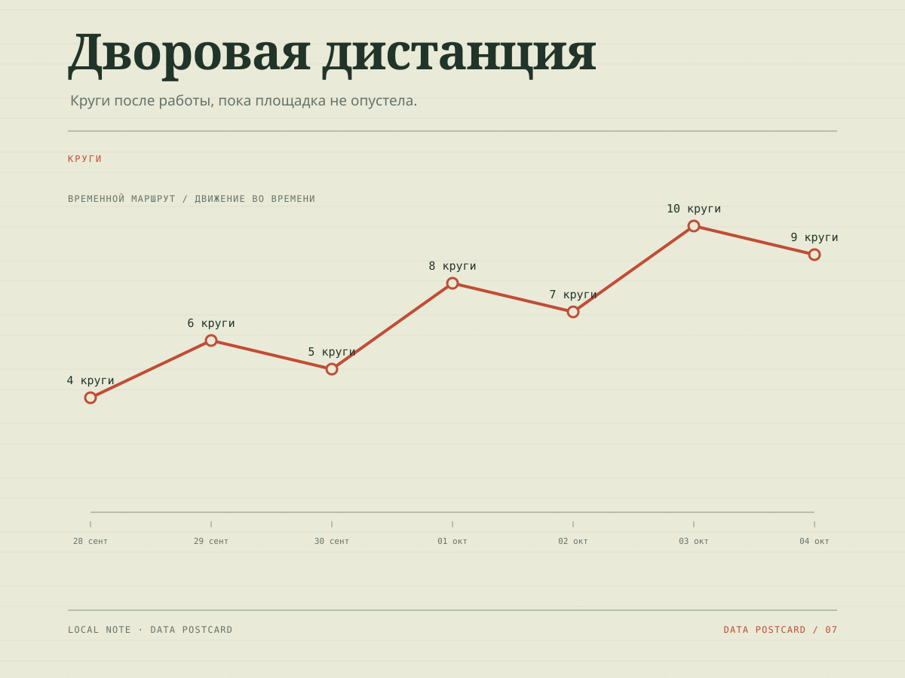

# Data Postcard

Небольшой локальный инструмент, который превращает CSV или JSON в одну выразительную визуальную открытку. Данные остаются в браузере: здесь нет сервера, аккаунтов, API, AI и внешней загрузки файлов.



## Как запустить

Откройте `index.html` через любой статический сервер или опубликуйте репозиторий на GitHub Pages. Для локального просмотра можно использовать:

```bash
python3 -m http.server 8000
```

Затем откройте `http://localhost:8000`.

## Что умеет инструмент

- принимает CSV/JSON через drag-and-drop, выбор файла или вставку 5–20 строк;
- определяет категории, числа и даты и показывает ошибки по строкам и колонкам; невалидный импорт не заменяет уже открытую открытку;
- строит четыре режима: полосы, точки, календарную сетку и временной маршрут;
- позволяет менять заголовок, подпись, единицы, порядок, колонки, тему и размер; сортировка чисел остаётся стабильной, а пустые значения уходят в конец;
- не теряет строки без даты во временном маршруте: внизу открытки показывает их количество и короткий список значений;
- экспортирует PNG, SVG и автономный HTML без сетевого доступа, с безопасными именами файлов и сообщением об ошибке;
- имеет темы «Ночной атлас», «Бумажная статистика», «Спортплощадка», «Архив» и чёрно-белую печать.

## Наборы данных

В папке `examples/` лежат три небольших набора:

- [`reading.csv`](./examples/reading.csv) — минуты чтения по дням;
- [`weather.json`](./examples/weather.json) — температура за неделю;
- [`sport.csv`](./examples/sport.csv) — круги на площадке.

Готовые результаты:





## Проверка

```bash
npm test
```

Локально проверены браузерный сценарий загрузки и вставки строк, сохранение предыдущей открытки после ошибки, переключение всех режимов и тем, Stories, три формата экспорта и адаптивная mobile-версия.
